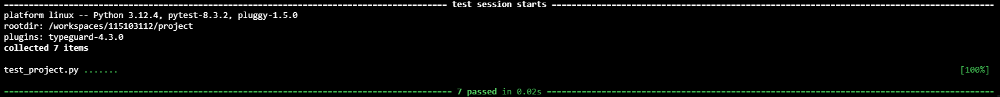

# Interactive Blackjack
#### Description:
Welcome to my interactive blackjack project! This is a python based project that simulates the classic card game, blackjack. The game allows you to bet virtual money, play against a dealer, and make decisions such as doubling down, hitting and standing. The goal of the game is to beat the dealer as close to 21 as possible without going over.

## Project Structure:
The project consists of the following files:
"project.py": Which is the main file containing the core logic and functionality for the game.
It includes the following key components:

### Classes:
- "Card": Represents a playing card with a rank and a suit. It includes methods such as determining the value of the card and returning a string representation for it.
- "Deck": Manages the deck of cards. It includes methods for shuffling and dealing, while using the card class to create a full deck of 52 cards.
- "Participant": A base class for both the "Player" and "Dealer". It manages the participanet's hand and calculates the total value based on the cards currently in hand.
- "Player": Inherits from "Participant" and represents the dealer. It includes methods to show the dealer's first card, reveal the dealer's full hand, and calculate the value of the dealer's first card.

### Functions:
- "main()": The main entry point of the program, resposible for initiating the game loop by calling the "menu()" function.
- "menu()": Manages the game menu, allowing the player to make a bet, learn the rules of the game and exit.
- "display_game_rules()": Displays the basic rules of Blackjack to the player.
- "game_starts()": Manages the actual gameplay, including dealing cards, handling player decisions(double down, hit or stand).
- "game_results()": Determines the outcome of the game based on the players and dealer points, and returns the deposit based on that outcome.
- "check_funds()": Checks whether the game can continue or not based on the deposit value.

### Tests:
"test_project.py": This file contains the test cases for the project, written using pytest:
 - "test_calculate_total()": Tests the calculation of the total value of a player's hand.
 - "test_deal_card()": Tests that a card is properly dealt from the deck and that the deck size goes down accordingly.
 - "test_deck_creation()": Tests the creation of a 52 card deck.
 - "test_first_card_value()": Tests the calculation of the value of the dealer's first hand.
 - "test_check_funds()": Tests whether the user has enough funds to continue.
 - "test_display_game_rules()": Tests whether the game rules are displayede correctly

## Design Choices:

### OOP:
The decision to use object oriented programming (OOP) was made to better encapsulate the data and behaviour of our components ("Card", "Deck", "Participant", "Player", "Dealer") and to further understand the concepts of OOP in python.

### Game Flow:
- The game follows the standard flow of a classic Blackjack game. The player has the option to make a bet, after which the cards are dealt, and then is presented with the 3 classic choices ("double down", "hit" and "stand). In the beginning just like in the classic game the player's 2 cards are visible, while the dealer does have 2 cards only 1 is revealed until the player decides/is forced to "sit".
- The dealer follows a set of predefined rules, such as hitting until the hand value reaches 17 or more and that his second card is hidden until the player decides to "sit".
- I tried to mimic the real life experience of a blackjack as closely as possible, starting with the game itself all the way to the betting balance.

## Future Improvements:
If I will try extending the project, I would considering adding this 2 main features:
- Allow multiple player to play
- Creating a graphic interface to enhance the user experience.

## Conclusions:
In the end I managed to create a real life interactive blackjack experience through the use of python and OOP principles.
This project significantly deepened my understanding OOP principles and Python as a language, and I would like to thank the CS50P team for providing this amazing course.

